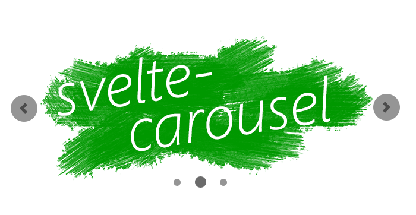

# svelte-carousel

<div align="left">

[](https://www.npmjs.com/package/svelte-carousel) [](https://www.npmjs.com/package/svelte-carousel)
<br />
[](https://github.com/vadimkorr/svelte-carousel) [](https://github.com/vadimkorr)

</div>

The awesome carousel component for Svelte 3

## Demo

https://vadimkorr.github.io/svelte-carousel \
[REPL](https://svelte.dev/repl/f503a458832f4a358d9ec00f88945ff5)

## Installation
```bash
yarn add svelte-carousel
```
```bash
npm install svelte-carousel
```

Import component
```jsx
<script>
  import Carousel from 'svelte-carousel'
  // ...
</script>
```

## Props
| Prop                      | Type       | Default         | Description                                   | 
|---------------------------|------------|-----------------|-----------------------------------------------|
| `arrows`                  | `boolean`  | `true`          | Enable Next/Prev arrows                       |
| `infinite`                | `boolean`  | `true`          | Infinite looping                              |
| `initialPageIndex`        | `number`   | `0`             | Page to start on                              |
| `duration`                | `number`   | `500`           | Transition duration (ms)                      |
| `autoplay`                | `boolean`  | `false`         | Enables auto play of pages                    |
| `autoplayDuration`        | `number`   | `3000`          | Autoplay change interval (ms)                 |
| `autoplayDirection`       | `string`   | `'next'`        | Autoplay change direction (`next` or `prev`)  |
| `pauseOnFocus`            | `boolean`  | `false`         | Pauses autoplay on focus (for desktop - hover over the carousel to toggle the autoplay, for touchable devices - tap the carousel to toggle the autoplay) |
| `autoplayProgressVisible` | `boolean`  | `false`         | Show autoplay duration progress indicator     |
| `dots`                    | `boolean`  | `true`          | Current page indicator dots                   |
| `timingFunction`          | `string`   | `'ease-in-out'` | CSS animation timing function                 |
| `swiping`                 | `boolean`  | `true`          | Enable swiping                                |

## Events

### `pageChange`
Is dispatched on page change

| Payload field      | Type        | Description                           | 
|--------------------|-------------|---------------------------------------|
| `event.detail`     | `number`    | Current page index                    |

```jsx
<Carousel
  on:pageChange={
    event => console.log(`Current page index: ${event.detail}`)
  }
>
  <!-- -->
</Carousel>
```

## Slots

### `prev` and `next`
They are used for customizing prev and next buttons.

Slot props:

| Prop               | Type        | Description                           | 
|--------------------|-------------|---------------------------------------|
| `showPrevPage`     | `function`  | Call it to switch to the previos page |
| `showNextPage`     | `function`  | Call it to switch to the next page    |

```jsx
<Carousel
  let:showPrevPage
  let:showNextPage
>
  <div slot="prev">
    <!-- -->
  </div>
  <div slot="next">
    <!-- -->
  </div>
  <!-- -->
</Carousel>
```

### `dots`

This slot is used for customizing dots appearance.

Slot props:

| Prop                | Type         | Description                                  | 
|---------------------|--------------|----------------------------------------------|
| `currentPageIndex`  | `number`     | Represents current page index (start from 0) |
| `pagesCount`        | `number`     | Total pages amount                           |
| `showPage`          | `function`   | Takes index as page to be shown              |

```jsx
<Carousel
  let:currentPageIndex
  let:pagesCount
  let:showPage
>
  <div slot="dots">
    <!-- -->
  </div>
  <!-- -->
</Carousel>
```

### Default slot

This slot takes content for the carousel.

Slot props:

| Prop              | Type       | Description                                                          | 
|-------------------|------------|----------------------------------------------------------------------|
| `loaded`          | `number[]` | Contains indexes of pages to be loaded. Can be used for lazy loading |

```jsx
<Carousel
  let:loaded
>
  <div>
    <!-- -->
  </div>
  <!-- -->
</Carousel>
```

## Methods

### `goTo`
Navigates to a page by index. `(pageIndex, options) => Promise<void>`.

Arguments:

| Argument           | Type        | Default | Description                           | 
|--------------------|-------------|---------|---------------------------------------|
| `pageIndex`        | `number`    |         | Page number                           |
| `options.animated` | `boolean`   | `true`  | Should it be animated or not          |

```jsx
<script>
  // ...
  let carousel;
  function goToStartPage() {
    carousel.goTo(0, { animated: false })
  }
</script>

<Carousel
  bind:this={carousel}
>
  <!--  -->
</Carousel>
<button class="button" on:click={goToStartPage}>Go</button>
```

### `goToPrev`
Navigates to the previous page. `(options) => Promise<void>`.

Arguments:

| Argument           | Type        | Default | Description                   | 
|--------------------|-------------|---------|-------------------------------|
| `options.animated` | `boolean`   | `true`  | Should it be animated or not  |

```jsx
<script>
  // ...
  let carousel;
  function goToPrevPage() {
    carousel.goToPrev({ animated: false })
  }
</script>

<Carousel
  bind:this={carousel}
>
  <!--  -->
</Carousel>
<button class="button" on:click={goToPrevPage}>Go</button>
```

### `goToNext`
Navigates to the next page. `(options) => Promise<void>`.

Arguments:

| Argument           | Type        | Default | Description                  | 
|--------------------|-------------|---------|------------------------------|
| `options.animated` | `boolean`   | `true`  | Should it be animated or not |

```jsx
<script>
  // ...
  let carousel;
  function goToNextPage() {
    carousel.goToNext({ animated: false })
  }
</script>

<Carousel
  bind:this={carousel}
>
  <!--  -->
</Carousel>
<button class="button" on:click={goToNextPage}>Go</button>
```
